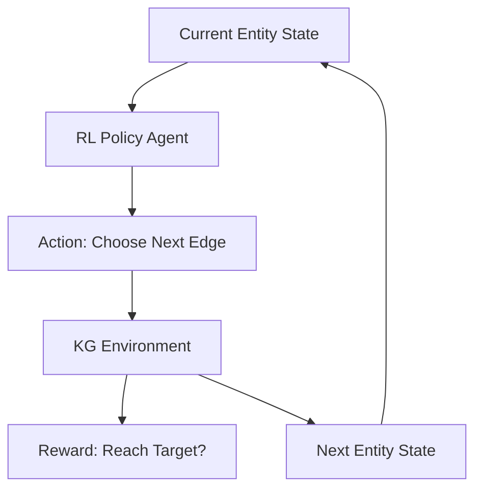

# 🤖 RL Explainable KG Reasoner

[](https://www.python.org/downloads/)
[](https://pytorch.org/)
[](https://opensource.org/licenses/MIT)

**RL-Explainable-KG-Reasoner** is a Reinforcement Learning (RL) framework designed to perform multi-hop reasoning over large-scale **Knowledge Graphs (KGs)**.

Inspired by research into explainable drug discovery, this project implements a policy-based RL agent that navigates the graph to find high-probability paths between entities (e.g., Disease → Gene → Biological Process → Drug), providing a clear "reasoning path" for every recommendation.

## 🌟 Key Features

- **Policy Gradient Agent:** Implements an actor-critic style agent to navigate the KG efficiently.
- **Explainable Pathways:** Instead of "black-box" scores, the agent returns the specific sequence of nodes and edges that justify a recommendation.
- **Biomedical Environment:** A custom OpenAI Gym-like environment for Knowledge Graphs.
- **Scalable Traversal:** Optimized for multi-hop reasoning (3-5+ hops) in dense biomedical networks.

## 🏗️ Architecture



## 🛠️ Installation

```bash
git clone https://github.com/gavedwards0/RL-Explainable-KG-Reasoner.git
cd RL-Explainable-KG-Reasoner
pip install -r requirements.txt
```

## 🔬 Example: Finding Drug Recommendations

The agent learns to find paths that connect a disease to potential therapeutic targets.

```python
from src.environment import KGEnv
from src.agent import RLAgent

# Initialize environment with a sample graph
env = KGEnv(graph_file="data/biomedical_kg.json")

# Load pre-trained agent
agent = RLAgent(state_dim=128, action_dim=env.action_space)

# Run reasoning
path, reward = agent.find_path(start_node="Alzheimers_Disease", target_type="Drug")

print(f"Recommended Path: {' -> '.join(path)}")
```

## 🤝 Contributing
Open to contributions in RL, GNNs, and Knowledge Representation.

## 👤 Author
**Gavin Edwards**  
Principal AI Engineer @i.AI | Ex-AstraZeneca
